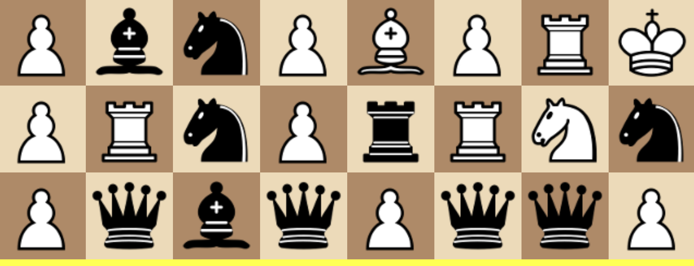

# *Chesses*

# [Play Online](https://www.pippinbarr.com/chesses/) (desktop and mobile)

## Description
*Your pieces slide! Your pieces fall! Your pieces do the strangest things! It's chesses unlike the chess you normally chess! Bet you can't chess just one!*

_Chesses_ is a set of eight variations on the classic game of chess. Each variation tends to involve addition of an extra rule to the game, whether it's pieces obeying gravity, sliding with momentum, or mutually annihilating each other on capture. Across all variations, I'm hopefully it will allow non-players of chess to get a kick out of the game.

## Press
Read the [Press kit](https://github.com/pippinbarr/chesses/blob/master/press/README.md) for press information

## Documentation
* Read the [Process documentation](../process) for process journal, to do list, and a "closing statement"
* Read the [Commit History](https://github.com/pippinbarr/chesses/commits/master) for step-by-step information about how the project was built
* Look at the [Code Repository](https://github.com/pippinbarr/chesses) for source code etc.

## License
_Chesses_ is an open source game licensed under a [Creative Commons Attribution-NonCommercial 3.0 Unported License](http://creativecommons.org/licenses/by-nc/3.0/). You can obtain the source code from its [code repository](https://github.com/pippinbarr/chesses) on GitHub.
