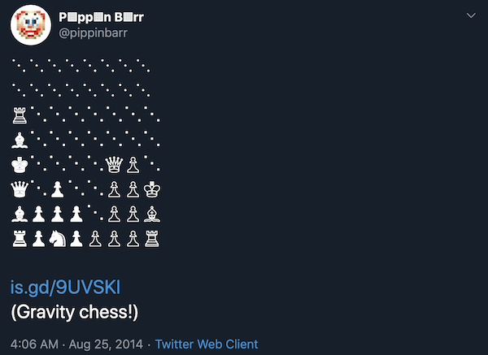
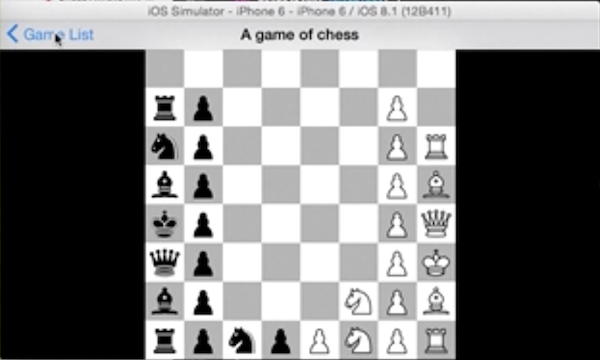
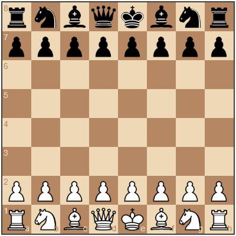
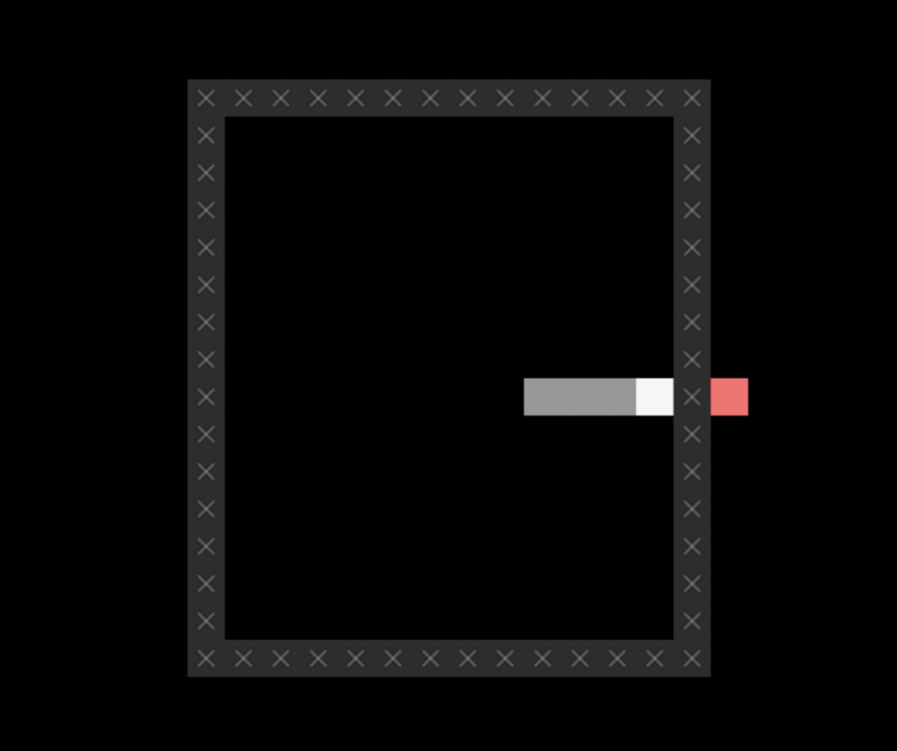
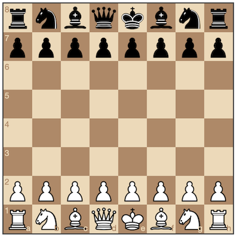
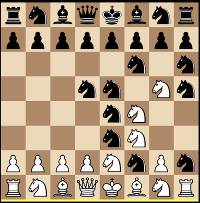
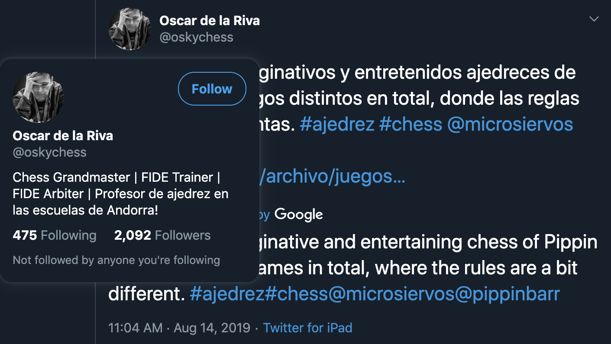

# Closing Statement

_Chesses_ was a surprising amount of fun to develop, but is one of those games that I don't necessarily find especially revealing in terms of a particular set of research questions or process study. Rather, it's a good example of a simple idea straightforwardly executed that was quite well received by its audience. Given its lack of grist for the mill of analysis, I'll just write a few basic thoughts about the process here and won't seek to get too "deep" (because I'm not sure the depth is there, and you don't want to dive into the shallow end etc.).

## Slow burn

One of the funny things about _Chesses_ is that it effectively started in 2014 when I was experimenting with Unicode chess characters to make chess tweets. At some point I settled on a format that had the "board" rotated 90º because it allowed for a cleaner-looking chess starting position, and from there started thinking about the pieces falling down to the bottom when they moved. That yielded the idea of Gravity Chess, which I ended up working on with Tom Curtis for a while in 2015 (well, he did the actual work), but never actually got done with it.

  
_The original tweet_

  
_Tom Curtis's version of Gravity Chess_

The game lay dormant until I decided I wanted to make more general chess variations in 2017, but fell at the first hurdle when I just couldn't decide on how to do it. I think this is chiefly because at the time I was focused on Phaser as my primary tool and the thought of implementing chess rules myself was terrifying (later confirmed when I got to see Jonathan struggling away with the Chogue engine). By the time July 2019 rolled around I'd already made a couple of games (_Best Chess_, _Rogess_, and _Let's Play: Ancient Greek Punishment: Chess Edition_) using chess.js and chessboard.js and felt relatively confident in my ability to create chess variants.

  
_Sisyphus as Chess_

All told it's a pretty nice tale of an idea that stuck around for a long time and eventually found its time to be born (alongside a few siblings).

## Let the engine fit the game, and vice versa

As above, I think it was hugely because of my existing experience with the two key JavaScript chess libraries that I was able to actually start the project. It's a perfect instance of using an engine/underlying code base that will facilitate your work. This is potentially particularly useful in the case of building variations on existing games because it saves the trouble of rebuilding the original game. Although I've done exactly that in past projects (e.g. _PONGS_, _BREAKSOUT_, _SNAKISMS_), it's clear to me that in the case of something as complex as chess it just wouldn't be practical to implement my own engine. Most importantly, I think, even if you _could_ implement the underlying engine, I don't know that it's a great idea. It seems mostly a chance to get lost in difficult coding challenges that don't actually contribute to the creative content of your project?

  
_Pessimist level in SNAKISMS, for which I implemented Snake myself (not that it's hard)_

The flipside of this, however, is that if you do use an "off the shelf" library or other code to provide you with the base level of a game, you're really going to be heavily influenced by that starting point in terms of your design. There's no question to me that the specific variations I produced in _Chesses_ were invented at least somewhat in conjunction with my knowledge of what was going to be feasible with the libraries I was using, and indeed that I dropped certain ideas because I felt they were going to be awkward to implement (e.g. I had a version that had "neutral" pieces on the board that both players could control, but could see this would be painful given that both lirbaries represent pieces as strictly white's or black's).

  
_chessboard.js is a very standard representation of chess_

There's nothing wrong with designing "to" your engine/library, of course, it's just that it _is_ going to be a driver in your design thinking and you are correspondingly "limited". Spun more positively, we could say these underlying tools represent an _opportunity_ to think in specific directions, so long as we're aware that's what's happening.

## Game as game design

Maybe the most "researchy" element of this game is this idea of a game itself as a representation of game design. Generally speaking, unless you're a game designer yourself, you're not all that likely to think about the underlying game design of a game you're playing. In the case of the  "variations" games I've made over the years (_PONGS_, _BREAKSOUT_, _SNAKISMS_, _Sibilant Snakelikes_, _Chesses_, the entire _Ancient Greek Punishment_ series), I think a big part of what I'm interested in conveying is the malleability of design. By showing a suite of variations on an understood base game, you're showing that this base game isn't a monolithic, unchangeable whole, but rather one game among many in a possibility space.

  
_What if chess looked like this?! (Quantum chess)_

In this way, you could think about _Chesses_ almost as a series of meditations on game design itself, not just for me as a design, but for any player. I like to think it "gives permission" to actually interrogate the idea of game design. Ideally this is not just in terms of "this is a good game design, this is a bad game design". Instead, I think what is interesting and worthwhile for a player is to feel encouraged to a) ask _why_ a particular game design was put together the way it is (what are the rules of "check" in Gravity chess for instance? Can a king "move through" check to get to a new location or not?) and b) to use this thought process as a jumping off point either to posit modifications to the existing variations or, even better, to posit entirely new variations of their own.

In the end, I think a lot of the games I end up producing are about this idea of thinking of the player as an "insider" in the design process. Perhaps I even do this too much, leading to games that are kind of opaque on first view unless you engage with them _as designed objects_?

## Summary

My dream, then, is perhaps that _Chesses_ is a kind of game design "textbook" or at least an "game design exercise for the player". It was fun to make, one of those games that flowed fairly easily from the materials to hand (the rules of chess, the underlying code), and was received surprisingly well given that it's, well, chess. Its greatest accomplishment? For now I think it's that a bone fide (ha ha) chess Grandmaster noticed the game and enjoyed the idea. One of the highest authorities indeed!

